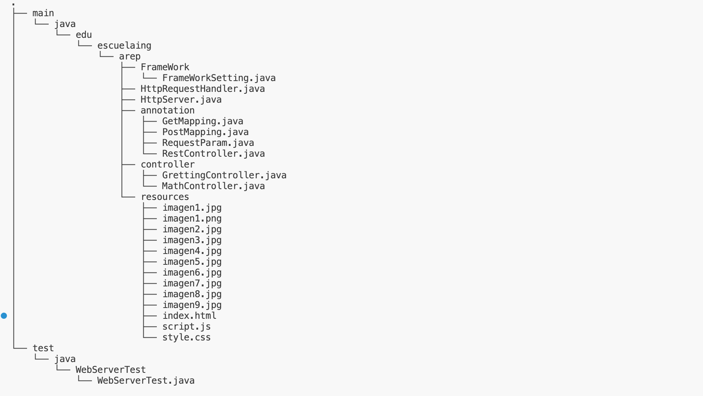
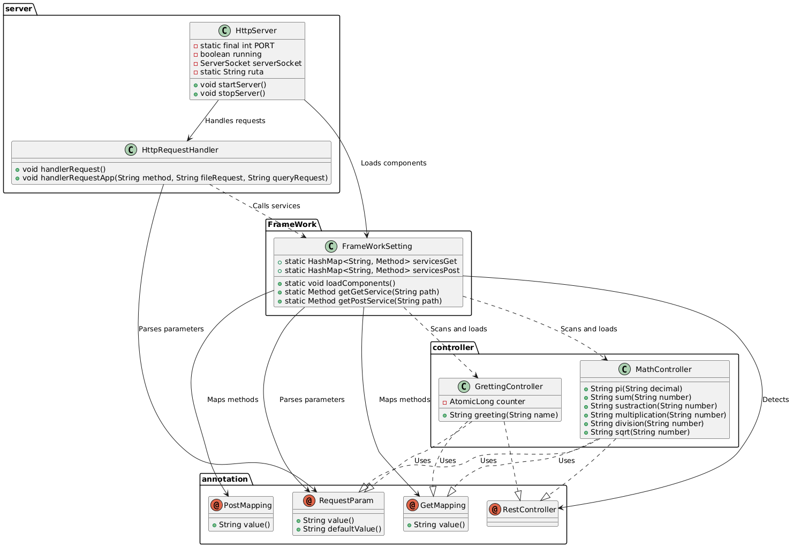
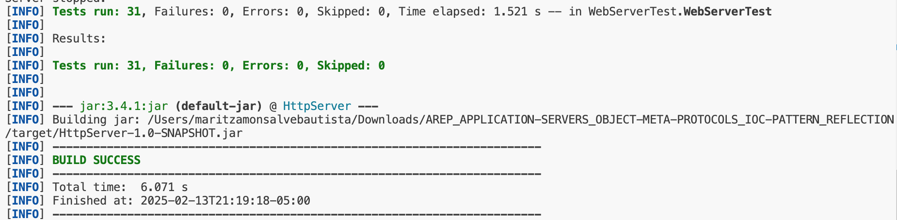

# Web server with IoC Framework

This project extends an existing web server into a full-featured framework, similar to Apache, focused on Java. It now uses annotations instead of lambda functions to define REST services. The server is capable of delivering HTML pages and PNG images. Additionally, it provides an Inversion of Control (IoC) framework for building web applications from POJOs, simplifying the development of modern and modular applications.


## Getting Started

The following instructions will allow you to run the project locally on your machine.

### Prerequisites

You need to have the following installed:

1. **Java** (versions 17 or 21)
   To verify the version in a console or terminal, run:

   ```sh
   java -version
   ```

   The output should look something like this:

   ```sh
   java version "17.0.12" 2024-07-16 LTS
   Java(TM) SE Runtime Environment (build 17.0.12+8-LTS-286)
   Java HotSpot(TM) 64-Bit Server VM (build 17.0.12+8-LTS-286, mixed mode, sharing)
   ```

2. **Maven**
   - To download, visit [here](https://maven.apache.org/download.cgi).
   - Follow the installation instructions [here](http://maven.apache.org/download.html#Installation).
   To verify the installation, run:

   ```sh
   mvn -v
   ```

   The output should look something like this:

   ```sh
   Apache Maven 3.9.9 (8e8579a9e76f7d015ee5ec7bfcdc97d260186937)
   Maven home: /Applications/apache-maven-3.9.9
   Java version: 17.0.12, vendor: Oracle Corporation, runtime: /Library/Java/JavaVirtualMachines/jdk-17.jdk/Contents/Home
   Default locale: es: `CO, platform encoding: UTF-8
   OS name: "mac os x", version: "12.7.6", arch: "x86: `64", family: "mac"
   ```

3. **Git**
   - To download, visit [here](https://git-scm.com/downloads).
   - Verify the installation by running:

   ```sh
   git --version
   ```

   The output should look something like this:

   ```sh
   git version 2.46.0
   ```

### Installation

1. Clone the repository and navigate to the folder containing the `pom.xml` file using the following commands:

   ```sh
   git clone https://github.com/Mar97231/AREP_APPLICATION-SERVERS_OBJECT-META-PROTOCOLS_IOC-PATTERN_REFLECTION.git
   cd AREP_APPLICATION-SERVERS_OBJECT-META-PROTOCOLS_IOC-PATTERN_REFLECTION
   ```

2. Build the project:

   ```sh
   mvn clean package
   ```

   The console output should look something like this:

   ```sh
    [INFO] Building jar: /Users/maritzamonsalvebautista/Downloads/AREP_APPLICATION-SERVERS_OBJECT-META-PROTOCOLS_IOC-PATTERN_REFLECTION/target/HttpServer-1.0-SNAPSHOT.jar
    [INFO] ------------------------------------------------------------------------
    [INFO] BUILD SUCCESS
    [INFO] ------------------------------------------------------------------------
    [INFO] Total time:  6.546 s
    [INFO] Finished at: 2025-02-13T20:54:00-05:00
    [INFO] ------------------------------------------------------------------------
   ```

3. Run the application:

      ```sh
      java -cp "target/classes" edu.escuelaing.arep.HttpServer
      ```
      The console should display the following message:
      ```sh
      Ready to receive on port: 35000 ...
      ```
      You can now access static resources like `index.html` or other resources stored in the `resources` folder.

4. Search in the browser http://localhost:35000/index.html, also http://localhost:35000/imagen1.jpg

   
   
   

# Architecture

## Server directory structure


### **Core Components**  

- **`HttpServer`**: The entry point of the application. Initializes the server, listens for incoming connections, and delegates request handling to `HttpRequestHandler`.  
- **`HttpRequestHandler`**: Handles HTTP requests and responses. It processes incoming requests, determines whether to serve a static file or forward the request to a registered controller method.  
- **`FrameWorkSetting`**: The core framework that scans classes annotated with `@RestController`, registers methods annotated with `@GetMapping` and `@PostMapping`, and routes HTTP requests accordingly.  
- **Annotations**: Includes custom annotations such as `@RestController`, `@GetMapping`, `@PostMapping`, and `@RequestParam` for defining web service routes and extracting parameters.  
- **Controllers**:  
  - `GrettingController`: Defines the `/greeting` endpoint, which returns a personalized greeting.  
  - `MathController`: Provides RESTful endpoints for mathematical operations such as sum, subtraction, multiplication, division, and square root.  

---

### **Flow of User Interaction**  

1. **Request**: A user sends an HTTP request from the browser (e.g., `GET /app/greeting?name=Maria`).  
2. **Request Handling**:  
   - `HttpServer` receives the request and passes it to `HttpRequestHandler`.  
   - If it's a request for a static file, `HttpRequestHandler` serves the file.  
   - If it's a request for a dynamic resource (like `/greeting` or `/sum`), it forwards the request to `FrameWorkSetting`.  
3. **Framework Processing**:  
   - `FrameWorkSetting` scans registered controllers and finds the method mapped to the requested endpoint.  
   - It extracts query parameters (if any) and invokes the corresponding method.  
4. **Response**: The controller method returns a response (e.g., `"Hello Maria!"`), which `HttpRequestHandler` sends back to the client.  

---

### **Example Interaction**  

For the endpoint `GET /app/greeting?name=Maria`:  

1. **User Request**: The user sends a request from a browser.  
2. **HttpServer**: Receives the request and passes it to `HttpRequestHandler`.  
3. **Framework Routing**:  
   - `FrameWorkSetting` identifies `GrettingController` and invokes the `greeting()` method.  
4. **Response**: The method returns `"Hello Maria!"`, which is sent back to the user's browser.


## 1. **HttpServer**  

### **Role:**  
Manages the lifecycle of the HTTP server, including handling incoming requests, storing static and dynamic REST endpoints, and routing requests to the appropriate handler.  

### **Responsibilities:**  
- Start and stop the server, listening on a specified port.  
- Accept incoming client connections and delegate request processing to `HttpRequestHandler`.  
- Store and manage static file paths for serving resources.  
- Register and store **GET** and **POST** request handlers using lambda functions.  
- Route incoming requests to the correct lambda function based on the HTTP method and path.  

### **Lambda Functions for Dynamic REST API:**  
- **`get(String path, BiFunction<HttpRequest, HttpResponse, String> restService)`**:  
  - Registers a lambda function to handle **GET** requests for a specific path.  
  - Example:  
    ```java
    get("/app/hello", (req, resp) -> "Hello, world");
    ```  
- **`post(String path, BiFunction<HttpRequest, HttpResponse, String> restService)`**:  
  - Registers a lambda function to handle **POST** requests for a specific path.  
  - Example:  
    ```java
    post("/app/hellopost", (req, resp) -> "Post received: " + req.getQueryParam("name"));
    ```  

## 2. **HttpRequestHandler**  

### **Role:**  
Processes client requests, determines the appropriate response, and redirects requests based on the HTTP method.

### **Responsibilities:**  
- Read and parse HTTP requests.  
- Determine whether to serve static files or process a REST request.  
- Redirect `GET` and `POST` requests to registered REST services.  
- Serve static files from the specified directory.  
- Send appropriate HTTP responses, handling errors like "404 Not Found."  
- Close the client socket after processing the request.  


## 3. **HttpResponse**  

### **Role:**  
Handles the construction and sending of HTTP responses, including status codes, headers, and body content.

### **Responsibilities:**  
- Set and manage HTTP status codes and messages.  
- Store and manage HTTP headers.  
- Store the response body.  
- Send the complete HTTP response to the client via a `PrintWriter`.  

---

## 4. **HttpRequest**  

### **Role:**  
Processes and extracts query parameters from an HTTP request.

### **Responsibilities:**  
- Parse query parameters from a URL-encoded string.  
- Provide access to query parameters via the `getQueryParam` method.  
- Decode query parameters to support special characters.  


### Interaction Flow

1. **Server Initialization**: The `HttpServer` starts and configures a `ServerSocket` on port 35000 (or the specified port). The server then waits for new client connections.

2. **Request Handling**:
   - When a client connects, the server accepts the connection and passes the socket to `HttpRequestHandler` to handle the request.
   - Inside `HttpRequestHandler`, the HTTP request is analyzed to determine what file or resource is being requested. Depending on the type of file or request (HTML, CSS, images, or POST/GET requests), the appropriate response is prepared.
   - The response is sent back to the client.

3. **Server Shutdown**: When the server needs to stop, the `ServerSocket` is closed and the server is gracefully shut down.

## Class Diagram


### Class Descriptions

### 1. **FrameWorkSetting**  
- **Responsibility**: Manages the discovery and mapping of annotated controller methods to their corresponding HTTP routes.  
- **Attributes**:  
  - `static HashMap<String, Method> servicesGet`: Stores methods mapped to GET requests.  
  - `static HashMap<String, Method> servicesPost`: Stores methods mapped to POST requests.  
- **Methods**:  
  - **`loadComponents()`**: It scans the package containing the controllers, identifies classes annotated with `@RestController`, and registers methods marked with `@GetMapping` and `@PostMapping` in the `servicesGet` and `servicesPost` maps, respectively.
  - **`getGetService(String path)`**: Retrieves the method associated with a GET request for the given path.  
  - **`getPostService(String path)`**: Retrieves the method associated with a POST request for the given path.  

---

### 2. **Annotations**  
#### **2.1 `@RestController`**  
- **Responsibility**: Marks a class as a REST controller, making its methods available as HTTP endpoints.  

#### **2.2 `@GetMapping`**  
- **Responsibility**: Specifies that a method should handle GET requests for a given path.  
- **Attributes**:  
  - `String value`: The URL path associated with the method.  

#### **2.3 `@PostMapping`**  
- **Responsibility**: Specifies that a method should handle POST requests for a given path.  
- **Attributes**:  
  - `String value`: The URL path associated with the method.  

#### **2.4 `@RequestParam`**  
- **Responsibility**: Maps a query parameter from the request to a method parameter.  
- **Attributes**:  
  - `String value`: The name of the request parameter.  
  - `String defaultValue`: The default value if the parameter is not provided.  

---

### 3. **GrettingController**  
- **Responsibility**: Provides a simple greeting endpoint.  
- **Attributes**:  
  - `AtomicLong counter`: A counter to track the number of requests.  
- **Methods**:  
  - **`greeting(String name)`**:  
    - Accepts a `name` parameter via `@RequestParam`.  
    - Returns a greeting message in the format `"Hello {name}!"`.  

---

### 4. **MathController**  
- **Responsibility**: Exposes mathematical operations as HTTP endpoints.  
- **Methods**:  
  - **`pi(String decimal)`**: Returns the value of π formatted with the specified number of decimal places.  
  - **`sum(String number)`**: Splits the input string by commas and returns the sum of the numbers.  
  - **`sustraction(String number)`**: Splits the input string and subtracts the numbers sequentially.  
  - **`multiplication(String number)`**: Splits the input string and multiplies the numbers sequentially. Returns an error message if there are fewer than two numbers.  
  - **`division(String number)`**: Divides the first number by the second. Returns an error message if division by zero is attempted.  
  - **`sqrt(String number)`**:  
    - Returns the square root of the given number.  
    - Returns an error message if the input is negative.  

---

### 5. **HttpRequestHandler**  
- **Responsibility**: Handles incoming HTTP requests, processes them, and sends responses.  
- **Methods**:  
  - **`handlerRequest()`**:  
    - Reads the incoming request.  
    - Parses the request method, path, and query parameters.  
    - Calls `handlerRequestApp()` to process the request.  
  - **`handlerRequestApp(String method, String fileRequest, String queryRequest)`**:  
    - Executes the corresponding method from `FrameWorkSetting` based on the request path.  

---

### 6. **HttpServer**  
- **Responsibility**: Initializes and manages the HTTP server, handling client connections.  
- **Attributes**:  
  - `static final int PORT`: The port number on which the server listens (35000).  
  - `boolean running`: Controls whether the server is running.  
  - `ServerSocket serverSocket`: The server socket for accepting connections.  
  - `static String ruta`: The directory containing static resources.  
- **Methods**:  
  - **`startServer()`**: Starts the server and listens for incoming connections and accepts client requests and delegates them to `HttpRequestHandler`.  
  - **`stopServer()`**: Stops the server by closing the server socket.

## TEST REPORT - Web Server IoC Framework

### Autor

Name: Maria Valentina Torres Monsalve

### Date

Date: 13/02/2025

### Test conducted

### **Static HTML File Loading Tests**  

- **`shouldLoadStaticFileHtml`**: Verifies that the server correctly loads `index.html` by sending a `GET` request and expecting a `200 OK` response, indicating that the file is available.  

- **`notShouldLoadStaticFileHtml`**: Ensures that the server does not load a non-existent file `web.html` by sending a `GET` request and expecting a `404 Not Found` response.  

### **CSS File Loading Tests**  

- **`shouldLoadStaticFileCss`**: Checks that the server correctly serves `style.css` by sending a `GET` request and expecting a `200 OK` response.  

- **`notShouldLoadStaticFileCss`**: Verifies that the server does not serve a non-existent file `styles.css` by sending a `GET` request and expecting a `404 Not Found` response.  

### **JavaScript File Loading Tests**  

- **`shouldLoadStaticFileJs`**: Ensures that the server correctly loads `script.js` by sending a `GET` request and expecting a `200 OK` response.  

- **`notShouldLoadStaticFileJs`**: Verifies that the server does not serve a non-existent file `prueba.js` by sending a `GET` request and expecting a `404 Not Found` response.


 

### **Static Image Loading Tests**  

- **`shouldLoadStaticImagePNG`**: Checks that the server can serve `imagen1.png` by sending a `GET` request and expecting a `200 OK` response.  

- **`shouldLoadStaticImageJPG`**: Verifies that the server correctly loads `imagen2.jpg` by sending a `GET` request and expecting a `200 OK` response.  

- **`notShouldLoadStaticImagePNG`**: Ensures that the server does not serve `imagen8.png` because it does not exist, expecting a `404 Not Found` response.  

- **`notShouldLoadStaticImageJPG`**: Checks that `imagen20.jpg` is not available on the server, expecting a `404 Not Found` response.  


### **`greeting` Controller Tests**  

- **`shouldLoadGreetingControllerWithQuery`**: Verifies that the API returns `{"response":"Hello maria !"}` when requesting `app/greeting?name=maria`.  

- **`shouldLoadGreetingControllerWithoutQuery`**: Ensures that the API returns `{"response":"Hello world !"}` when requesting `app/greeting` without parameters.  

- **`notShouldLoadGreetingControllerWithQuery`**: Ensures that the API **does not** return `{"response":"Hello juan !"}` when requesting `app/greeting?name=maria`.  


## **Mathematical Controller Tests**  

- **`shouldLoadMathControllerPIWithQuery`**: Verifies that the API returns `{"response":"3,14159"}` when requesting `app/pi?decimals=5`.  

- **`shouldLoadMathControllerPIWithoutQuery`**: Ensures that the API returns `{"response":"3,14"}` when requesting `app/pi` without parameters.  

- **`notShouldLoadMathControllerPIWithQuery`**: Ensures that the API **does not** return `{"response":"3,141"}` when requesting `app/pi?decimals=5`.  


- **`shouldLoadMathControllerSumWithQuery`**: Verifies that the API returns `{"response":"10"}` when requesting `app/sum?number=3,2,5`.  

- **`shouldLoadMathControllerSumWithoutQuery`**: Ensures that the API returns `{"response":"No numbers entered"}` when requesting `app/sum` without parameters.  


- **`shouldLoadMathControllerDivWithQuery`**: Ensures that the API returns `{"response":"2.0"}` when requesting `app/div?number=4,2`.  

- **`shouldLoadMathControllerDiv2WithQuery`**: Verifies that the API returns `{"response":"Cannot divide by 0"}` when requesting `app/div?number=4,0`, properly handling division by zero.  


- **`shouldLoadMathControllerMulWithQuery`**: Ensures that the API returns the correct multiplication result when requesting `app/mul?number=2,3,4`, expecting `{"response":"24"}`.  

- **`notShouldLoadMathControllerMulWithQuery`**: Verifies that the API does not return an incorrect multiplication result when requesting `app/mul?number=2,3,4`, ensuring proper computation.  


- **`shouldLoadMathControllerSubWithQuery`**: Ensures that the API returns the correct subtraction result when requesting `app/sub?number=10,3,2`, expecting `{"response":"5"}`.  

- **`notShouldLoadMathControllerSubWithQuery`**: Verifies that the API does not return an incorrect subtraction result when requesting `app/sub?number=10,3,2`, ensuring proper computation.  




## Built With

[Maven](https://maven.apache.org/index.html) - Dependency Management

[Git](https://git-scm.com) - Version Control System

## Authors

Maria Valentina Torres Monsalve - [Mar972310](https://github.com/Mar972310)
