# Web server with IoC Framework

This project extends an existing web server into a full-featured framework, similar to Apache, focused on Java. It now uses annotations instead of lambda functions to define REST services. The server is capable of delivering HTML pages and PNG images. Additionally, it provides an Inversion of Control (IoC) framework for building web applications from POJOs, simplifying the development of modern and modular applications.


## Getting Started

The following instructions will allow you to run the project locally on your machine.

### Prerequisites

You need to have the following installed:

1. **Java** (versions 17 or 21)
   To verify the version in a console or terminal, run:

   ```sh
   java -version
   ```

   The output should look something like this:

   ```sh
   java version "17.0.12" 2024-07-16 LTS
   Java(TM) SE Runtime Environment (build 17.0.12+8-LTS-286)
   Java HotSpot(TM) 64-Bit Server VM (build 17.0.12+8-LTS-286, mixed mode, sharing)
   ```

2. **Maven**
   - To download, visit [here](https://maven.apache.org/download.cgi).
   - Follow the installation instructions [here](http://maven.apache.org/download.html#Installation).
   To verify the installation, run:

   ```sh
   mvn -v
   ```

   The output should look something like this:

   ```sh
   Apache Maven 3.9.9 (8e8579a9e76f7d015ee5ec7bfcdc97d260186937)
   Maven home: /Applications/apache-maven-3.9.9
   Java version: 17.0.12, vendor: Oracle Corporation, runtime: /Library/Java/JavaVirtualMachines/jdk-17.jdk/Contents/Home
   Default locale: es: `CO, platform encoding: UTF-8
   OS name: "mac os x", version: "12.7.6", arch: "x86: `64", family: "mac"
   ```

3. **Git**
   - To download, visit [here](https://git-scm.com/downloads).
   - Verify the installation by running:

   ```sh
   git --version
   ```

   The output should look something like this:

   ```sh
   git version 2.46.0
   ```

4. **Docker**
   - To download, visit [here](https://www.docker.com/).
   - Verify the installation by running:

   ```sh
   docker --version
   ```

   The output should look something like this:

   ```sh
   Docker version 25.0.3, build 4debf41
   ```

### Installation

1. Clone the repository and navigate to the folder containing the `pom.xml` file using the following commands:

   ```sh
   git clone https://github.com/Mar972310/AREP_MODULARIZATION_WITH_VIRTUALIZATION_AND_INTRODUCTION_TO_DOCKER.git
   cd AREP_MODULARIZATION_WITH_VIRTUALIZATION_AND_INTRODUCTION_TO_DOCKER
   ```

2. Build the project:

   ```sh
   mvn clean package
   ```

   The console output should look something like this:

   ```sh
    [INFO] Installing /Users/maritzamonsalvebautista/Desktop/AREP_MODULARIZATION_WITH_VIRTUALIZATION_AND_INTRODUCTION_TO_DOCKER/target/HttpServer-1.0-SNAPSHOT.jar to /Users/maritzamonsalvebautista/.m2/repository/edu/escuelaing/arep/HttpServer/1.0-SNAPSHOT/HttpServer-1.0-SNAPSHOT.jar
    [INFO] ------------------------------------------------------------------------
    [INFO] BUILD SUCCESS
    [INFO] ------------------------------------------------------------------------
    [INFO] Total time:  8.799 s
    [INFO] Finished at: 2025-02-25T21:46:51-05:00
    [INFO] ------------------------------------------------------------------------
   ```

3. Run the application:

      ```sh
      java -cp "target/classes" edu.escuelaing.arep.HttpServer
      ```
      The console should display the following message:
      ```sh
      Ready to receive on port: 35000 ...
      ```
      You can now access static resources like `index.html` or other resources stored in the `resources` folder.

4. Search in the browser http://localhost:35000/index.html, also http://localhost:35000/imagen1.jpg

   
   
   

# Architecture
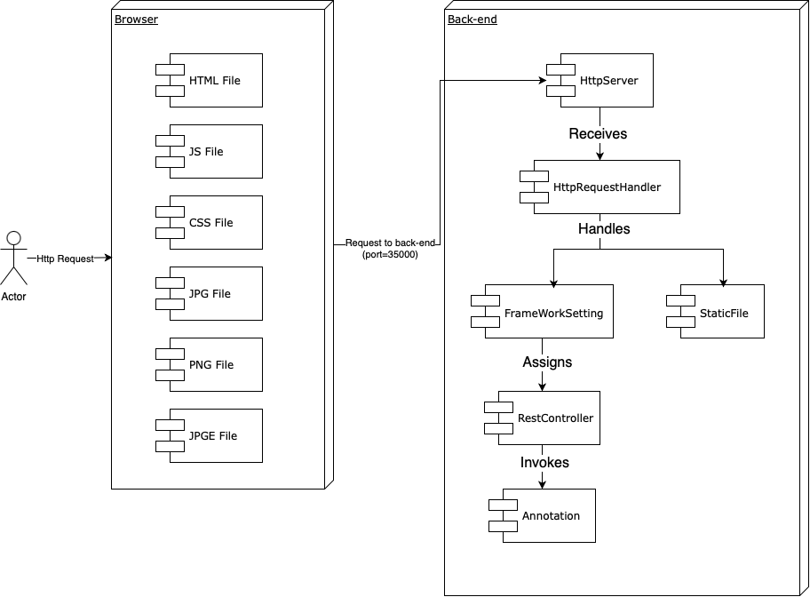

## Server directory structure
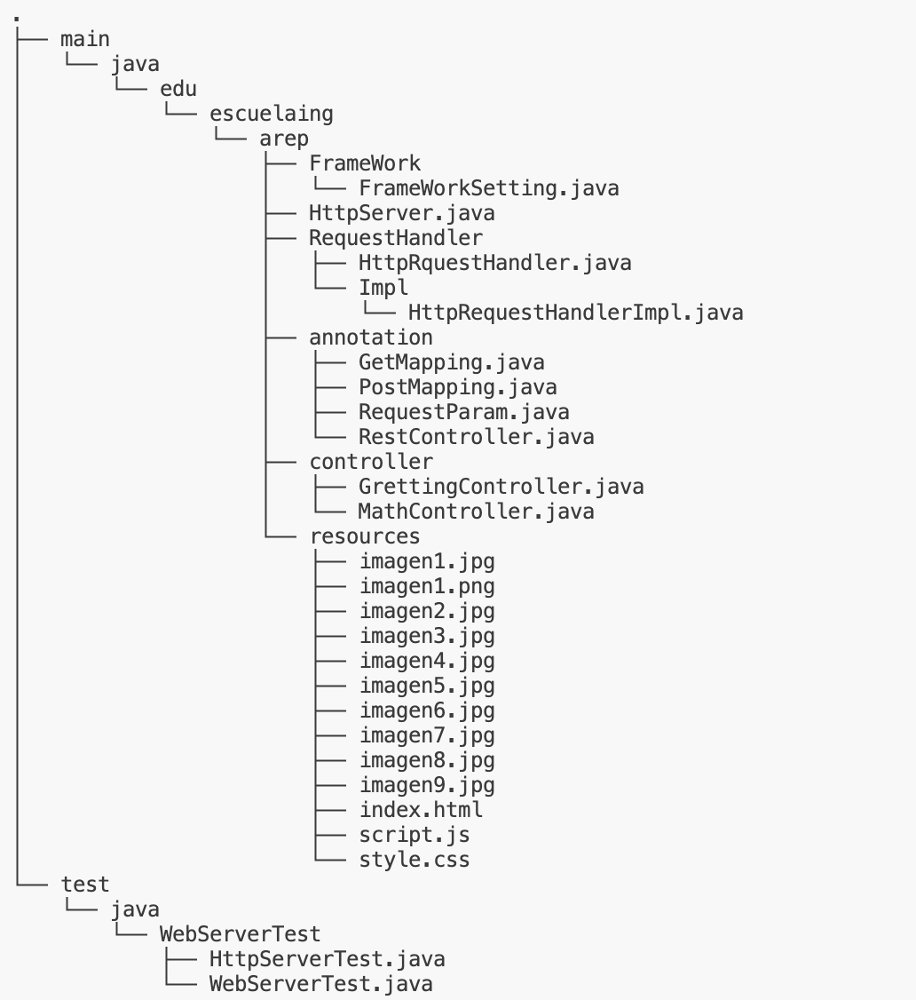

### **Core Components**  

- **`HttpServer`**: The entry point of the application. Initializes the server, listens for incoming connections, and delegates request handling to `HttpRequestHandler`.  
- **`HttpRequestHandlerImpl`**: Handles HTTP requests and responses. It processes incoming requests, determines whether to serve a static file or forward the request to a registered controller method.  
- **`FrameWorkSetting`**: The core framework that scans classes annotated with `@RestController`, registers methods annotated with `@GetMapping` and `@PostMapping`, and routes HTTP requests accordingly.  
- **Annotations**: Includes custom annotations such as `@RestController`, `@GetMapping`, `@PostMapping`, and `@RequestParam` for defining web service routes and extracting parameters.  
- **Controllers**:  
  - `GrettingController`: Defines the `/greeting` endpoint, which returns a personalized greeting.  
  - `MathController`: Provides RESTful endpoints for mathematical operations such as sum, subtraction, multiplication, division, and square root.  

---

### **Flow of User Interaction**  

1. **Request**: A user sends an HTTP request from the browser (e.g., `GET /app/greeting?name=Maria`).  
2. **Request Handling**:  
   - `HttpServer` receives the request and passes it to `HttpRequestHandler`.  
   - If it's a request for a static file, `HttpRequestHandler` serves the file.  
   - If it's a request for a dynamic resource (like `/greeting` or `/sum`), it forwards the request to `FrameWorkSetting`.  
3. **Framework Processing**:  
   - `FrameWorkSetting` scans registered controllers and finds the method mapped to the requested endpoint.  
   - It extracts query parameters (if any) and invokes the corresponding method.  
4. **Response**: The controller method returns a response (e.g., `"Hello Maria!"`), which `HttpRequestHandler` sends back to the client.  

---

### **Example Interaction**  

For the endpoint `GET /app/greeting?name=Maria`:  

1. **User Request**: The user sends a request from a browser.  
2. **HttpServer**: Receives the request and passes it to `HttpRequestHandler`.  
3. **Framework Routing**:  
   - `FrameWorkSetting` identifies `GrettingController` and invokes the `greeting()` method.  
4. **Response**: The method returns `"Hello Maria!"`, which is sent back to the user's browser.


## Class Diagram
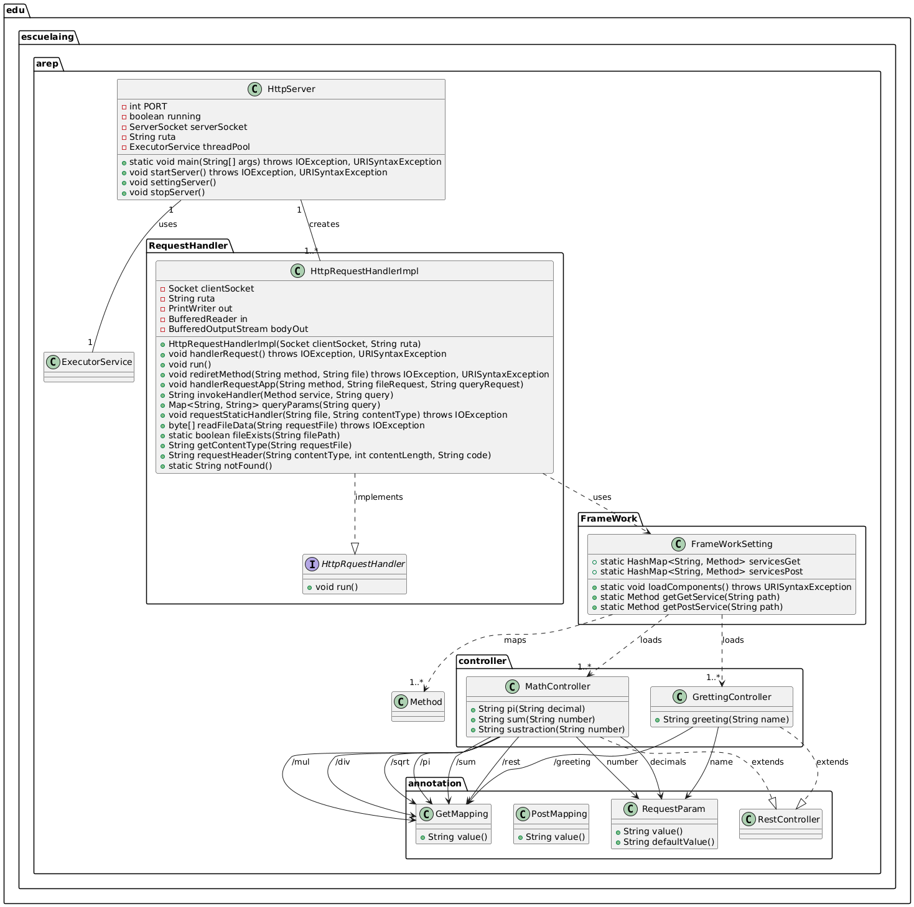

### Class Descriptions

### 1. **FrameWorkSetting**  
- **Responsibility**: Manages the discovery and mapping of annotated controller methods to their corresponding HTTP routes.  
- **Attributes**:  
  - `static HashMap<String, Method> servicesGet`: Stores methods mapped to GET requests.  
  - `static HashMap<String, Method> servicesPost`: Stores methods mapped to POST requests.  
- **Methods**:  
  - **`loadComponents()`**: It scans the package containing the controllers, identifies classes annotated with `@RestController`, and registers methods marked with `@GetMapping` and `@PostMapping` in the `servicesGet` and `servicesPost` maps, respectively.
  - **`getGetService(String path)`**: Retrieves the method associated with a GET request for the given path.  
  - **`getPostService(String path)`**: Retrieves the method associated with a POST request for the given path.  

---

### 2. **Annotations**  
#### **2.1 `@RestController`**  
- **Responsibility**: Marks a class as a REST controller, making its methods available as HTTP endpoints.  

#### **2.2 `@GetMapping`**  
- **Responsibility**: Specifies that a method should handle GET requests for a given path.  
- **Attributes**:  
  - `String value`: The URL path associated with the method.  

#### **2.3 `@PostMapping`**  
- **Responsibility**: Specifies that a method should handle POST requests for a given path.  
- **Attributes**:  
  - `String value`: The URL path associated with the method.  

#### **2.4 `@RequestParam`**  
- **Responsibility**: Maps a query parameter from the request to a method parameter.  
- **Attributes**:  
  - `String value`: The name of the request parameter.  
  - `String defaultValue`: The default value if the parameter is not provided.  

---

### 3. **GrettingController**  
- **Responsibility**: Provides a simple greeting endpoint.  
- **Attributes**:  
  - `AtomicLong counter`: A counter to track the number of requests.  
- **Methods**:  
  - **`greeting(String name)`**:  
    - Accepts a `name` parameter via `@RequestParam`.  
    - Returns a greeting message in the format `"Hello {name}!"`.  

---

### 4. **MathController**  
- **Responsibility**: Exposes mathematical operations as HTTP endpoints.  
- **Methods**:  
  - **`pi(String decimal)`**: Returns the value of π formatted with the specified number of decimal places.  
  - **`sum(String number)`**: Splits the input string by commas and returns the sum of the numbers.  
  - **`sustraction(String number)`**: Splits the input string and subtracts the numbers sequentially.  
  - **`multiplication(String number)`**: Splits the input string and multiplies the numbers sequentially. Returns an error message if there are fewer than two numbers.  
  - **`division(String number)`**: Divides the first number by the second. Returns an error message if division by zero is attempted.  
  - **`sqrt(String number)`**:  
    - Returns the square root of the given number.  
    - Returns an error message if the input is negative.  

### 5. **HttpRequestHandlerImpl**  
- **Responsibility**: Implements `HttpRequestHandler` to handle HTTP requests.  
- **Attributes**:  
  - `clientSocket`: Socket connecting the server and client.  
  - `path`: Base directory for static files.  
  - `out`: `PrintWriter` for sending responses.  
  - `in`: `BufferedReader` for reading requests.  
  - `bodyOut`: `BufferedOutputStream` for response body (e.g., static files).  
- **Methods**:  
  - **`HttpRequestHandlerImpl(Socket clientSocket, String path)`**: Constructor for initializing the socket and static file path.  
  - **`handlerRequest()`**: Reads and processes the request, redirects based on HTTP method (GET/POST).  
  - **`run()`**: Implements `Runnable`, calls `handlerRequest()` when executed in a thread.  
  - **`redirectMethod(String method, String file)`**: Redirects request to appropriate handler based on method and file.  
  - **`handlerRequestApp(String method, String fileRequest, String queryRequest)`**: Handles non-static file requests, delegates to the corresponding service.  
  - **`invokeHandler(Method service, String query)`**: Executes service method with query parameters.  
  - **`queryParams(String query)`**: Converts query string into key-value map.  
  - **`requestStaticHandler(String file, String contentType)`**: Handles static file requests, sends the file to the client.  
  - **`readFileData(String requestFile)`**: Reads file and returns as byte array.  
  - **`fileExists(String filePath)`**: Checks if file exists at specified path.  
  - **`getContentType(String requestFile)`**: Returns content type based on file extension.  
  - **`requestHeader(String contentType, int contentLength, String code)`**: Generates HTTP response header.  
  - **`notFound()`**: Returns custom 404 error page.  

### 6. **HttpRequestHandler**  
  - **Responsibility**: Defines a contract for handling HTTP requests.  
  - **Methods**:  
    - **`run()`**: Method to handle the client's request, part of `Runnable` interface, enabling execution in a thread.

### 7. **HttpServer**  
  - **Responsibility**: Initializes and manages the HTTP server, handling client connections.  
  - **Attributes**:  
    - `static final int PORT`: The port number on which the server listens (35000).  
    - `boolean running`: Controls whether the server is running.  
    - `ServerSocket serverSocket`: The server socket for accepting connections.  
    - `static String ruta`: The directory containing static resources.  
  - **Methods**:  
    - **`startServer()`**: Starts the server and listens for incoming connections and accepts client requests and delegates them to `HttpRequestHandler`.  
    - **`stopServer()`**: Stops the server by closing the server socket.

# Deployment on AWS
To successfully deploy the HTTP server, we had to add the following in the `pom.xml`:

```xml
<build>
    <plugins>
        <plugin>
            <groupId>org.apache.maven.plugins</groupId>
            <artifactId>maven-dependency-plugin</artifactId>
            <version>3.0.1</version>
            <executions>
                <execution>
                    <id>copy-dependencies</id>
                    <phase>package</phase>
                    <goals><goal>copy-dependencies</goal></goals>
                </execution>
            </executions>
        </plugin>
    </plugins>
    <resources>
        <resource>
            <directory>src/main/java/edu/escuelaing/arep/resources</directory>
            <targetPath>${project.build.directory}/classes/edu/escuelaing/arep/resources</targetPath>
            <includes>
                <include>**/*</include>
            </includes>
        </resource>
    </resources>
</build>
```

After compiling the code, obtaining the target with all dependencies copied, and configuring the Dockerfile, we need to follow these steps:

## 1. Create the Docker Image

Run the following command to create the image with our respective configuration:

```bash
docker build --tag httpserver .
```

Once the process is complete, we can view the created images using the `docker ps` command or from Docker Desktop.

### Example Output:

```
CONTAINER ID   IMAGE                                                                    COMMAND                  CREATED          STATUS          PORTS                      NAMES
52244cb6230c   arep_modularization_with_virtualization_and_introduction_to_docker-web   "java -cp ./classes:…"   4 minutes ago    Up 4 minutes    0.0.0.0:8080->6000/tcp     httpServer
```

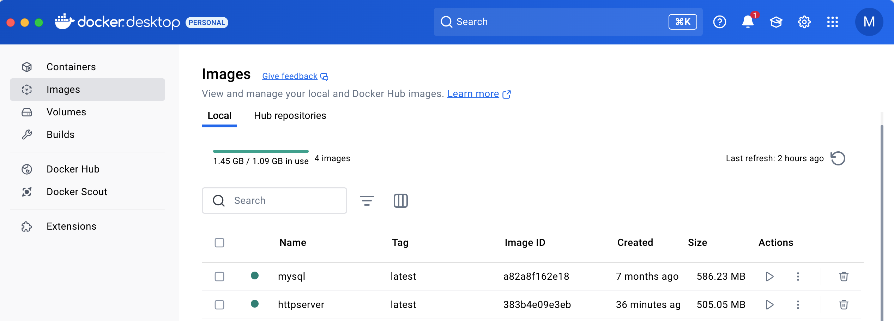

## 2. Create the Docker Container

Run the following command to create the container:

```bash
docker run -d -p 34000:6000 --name httpservercontainer httpserver
```

In the console, you will see the container ID:

```
c208db106d2cb034c0e6b097376ede35a3950e1fb6ee9455559338e5277693bf
```

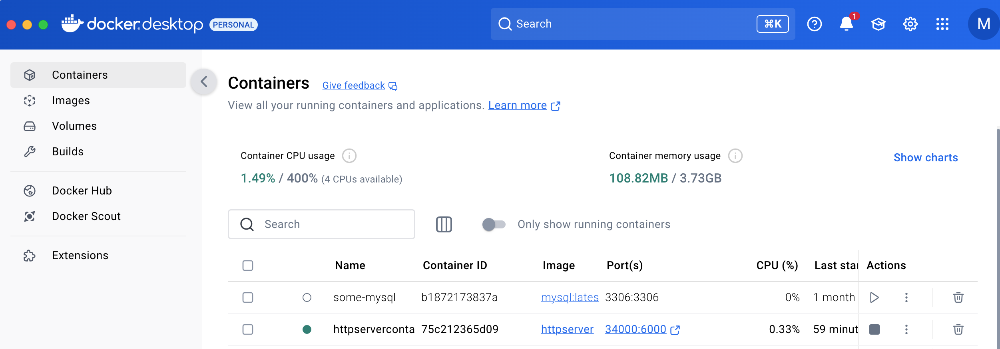

## 3. Configuration with Docker Compose

Run the `docker-compose up -d` command after configuring the container network in the `docker-compose.yml` file. This will automatically create the container.

### Example Console Output:

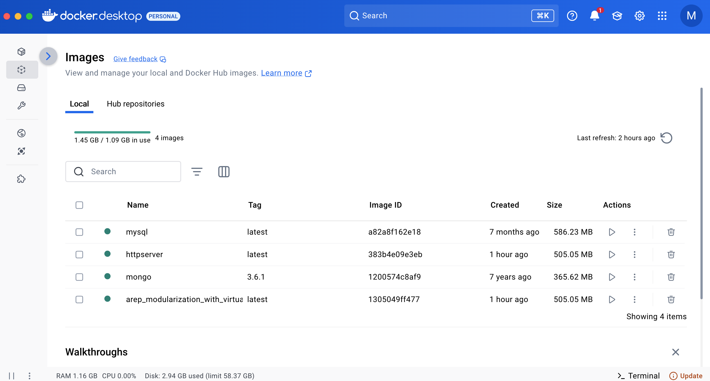  
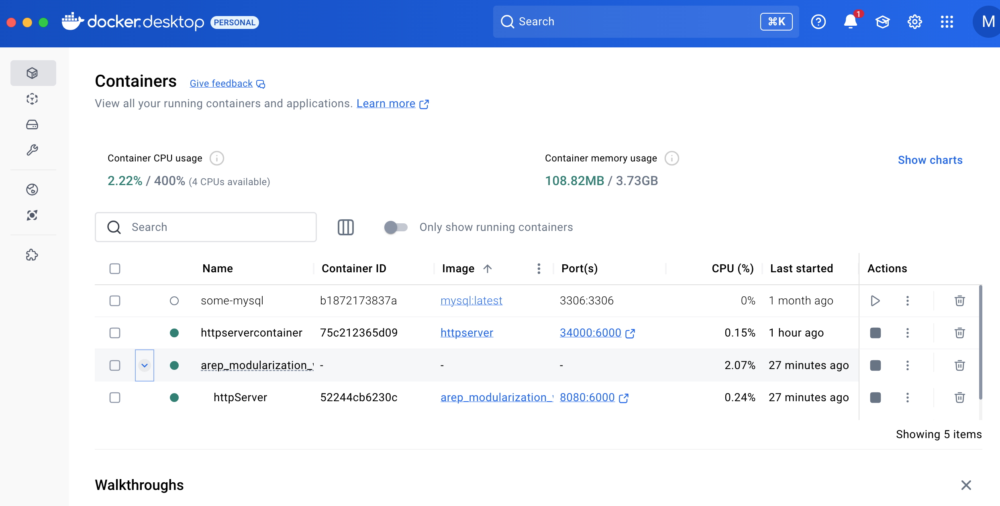

## 4. Tag the Image for Docker Hub

To create an image pointing to our Docker Hub repository, use the following command:

```bash
docker tag httpserver mandarina972310/modularization_with_virtualization_and_introduction_to_docker
```

We can verify that the image is correctly tagged in Docker Desktop:

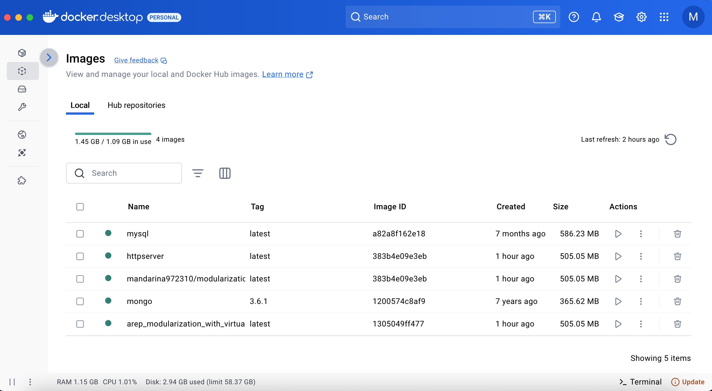

## 5. Push the Image to Docker Hub

Log in to Docker Hub and push the image using the following command:

```bash
docker login
docker push mandarina972310/modularization_with_virtualization_and_introduction_to_docker:latest
```

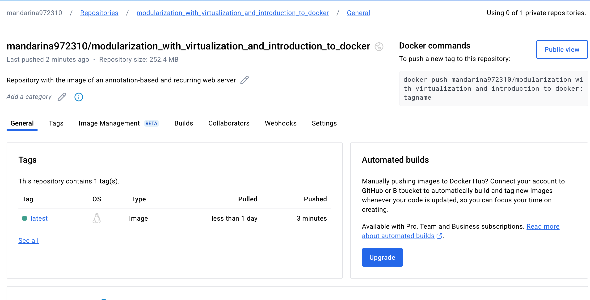

## 6. Install Docker on AWS

From the EC2 instance in AWS, install Docker with the following command:

```bash
sudo yum install docker
```

### Command Output:

```
Installed:
  containerd-1.7.25-1.amzn2023.0.1.x86_64
  docker-25.0.8-1.amzn2023.0.1.x86_64
  iptables-libs-1.8.8-3.amzn2023.0.2.x86_64
  iptables-nft-1.8.8-3.amzn2023.0.2.x86_64
  libcgroup-3.0-1.amzn2023.0.1.x86_64
  libnetfilter_conntrack-1.0.8-2.amzn2023.0.2.x86_64
  libnfnetlink-1.0.1-19.amzn2023.0.2.x86_64
  libnftnl-1.2.2-2.amzn2023.0.2.x86_64
  pigz-2.5-1.amzn2023.0.3.x86_64
  runc-1.2.4-1.amzn2023.0.1.x86_64

Complete!
```

## 7. Start the Docker Service

Start the Docker service with the following command:

```bash
sudo service docker start
```

### Command Output:

```
Redirecting to /bin/systemctl start docker.service
```

## 8. Create a User with Permissions (Optional)

If you don’t want to use `sudo` before every Docker command, you can create a user with permissions:

```bash
sudo usermod -a -G docker ec2-user
```

After running this command, you must log out of the SSH session and log back in.

## 9. Pull the Image from Docker Hub

Download the image from our Docker Hub repository using the following command:

```bash
docker run -d -p 8080:6000 --name httpserver mandarina972310/modularization_with_virtualization_and_introduction_to_docker
```

## 10. Enable the Port on AWS

We need to enable the port assigned in the previous command (`8080:6000`) in the AWS security settings. To do this, add a new rule in the security group.

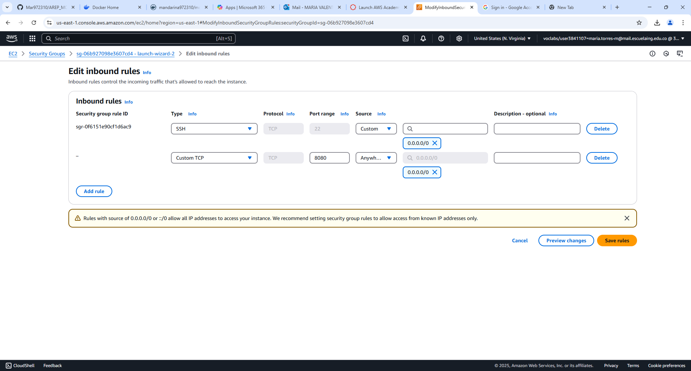

## 11. Access the Application

Once the port is enabled, we can access the page at the following link:

[http://ec2-44-203-95-133.compute-1.amazonaws.com:8080/index.html](http://ec2-44-203-95-133.compute-1.amazonaws.com:8080/index.html)

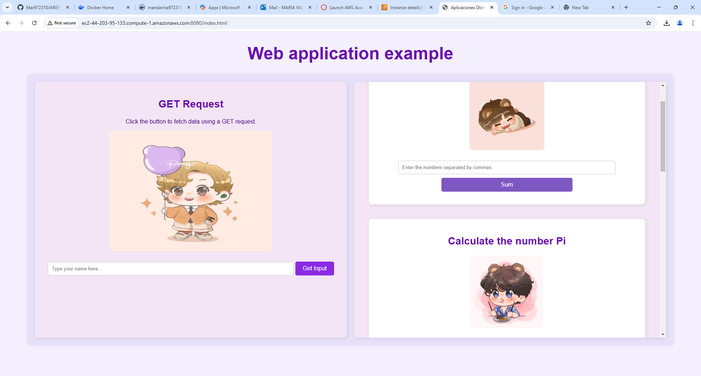

---

### DEPLOYMENT VIDEO

<video width="" height="" controls autoplay>
  <source src="images/despliegue.mp4" type="video/mp4">
</video>

<video width="" height="" controls autoplay>
  <source src="images/consulta.mp4" type="video/mp4">
</video>

## TEST REPORT - Web Server IoC Framework

### Autor

Name: Maria Valentina Torres Monsalve

### Date

Date: 27/02/2025

### Test conducted

### Concurrency Test for Static Files

- **`testConcurrency`**  
  **Description**: Tests server's ability to handle multiple concurrent requests for the static file `index.html`.  
  **Test Steps**:
  1. Initiate 20 concurrent threads.
  2. Each thread sends a `GET` request to `http://localhost:35000/index.html`.
  3. Assert that each thread receives a `200 OK` response.
  4. Ensure that all threads complete without errors.

### Concurrency Test with Non-Existent File

- **`testConcurrencyWithNonExistentFile`**  
  **Description**: Tests server's behavior when multiple concurrent requests are made for a non-existent file `myPage.html`.  
  **Test Steps**:
  1. Initiate 5 concurrent threads.
  2. Each thread sends a `GET` request to `http://localhost:35000/myPage.html`.
  3. Assert that each thread receives a `404 Not Found` response.
  4. Ensure that all threads complete without errors.

### **Static HTML File Loading Tests**  

- **`shouldLoadStaticFileHtml`**: Verifies that the server correctly loads `index.html` by sending a `GET` request and expecting a `200 OK` response, indicating that the file is available.  

- **`notShouldLoadStaticFileHtml`**: Ensures that the server does not load a non-existent file `web.html` by sending a `GET` request and expecting a `404 Not Found` response.  

### **CSS File Loading Tests**  

- **`shouldLoadStaticFileCss`**: Checks that the server correctly serves `style.css` by sending a `GET` request and expecting a `200 OK` response.  

- **`notShouldLoadStaticFileCss`**: Verifies that the server does not serve a non-existent file `styles.css` by sending a `GET` request and expecting a `404 Not Found` response.  

### **JavaScript File Loading Tests**  

- **`shouldLoadStaticFileJs`**: Ensures that the server correctly loads `script.js` by sending a `GET` request and expecting a `200 OK` response.  

- **`notShouldLoadStaticFileJs`**: Verifies that the server does not serve a non-existent file `prueba.js` by sending a `GET` request and expecting a `404 Not Found` response.

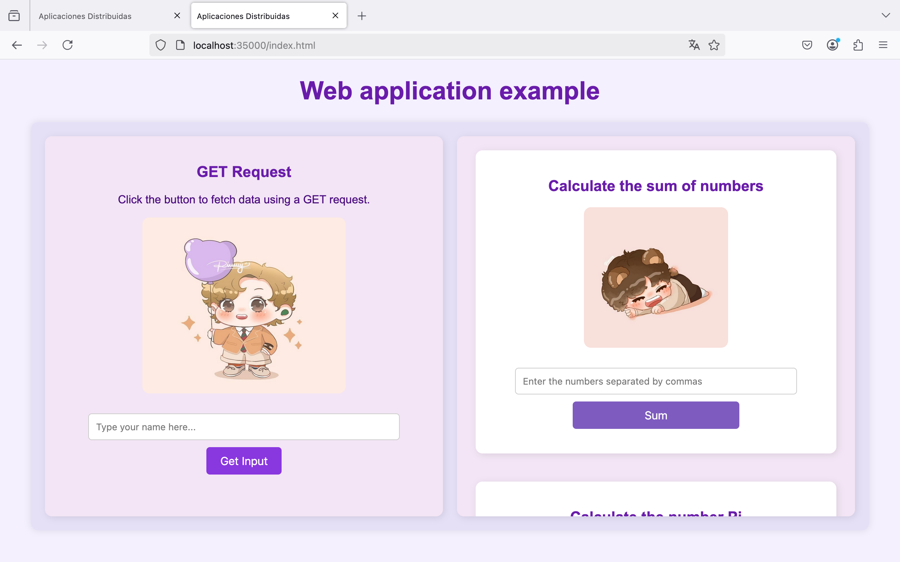
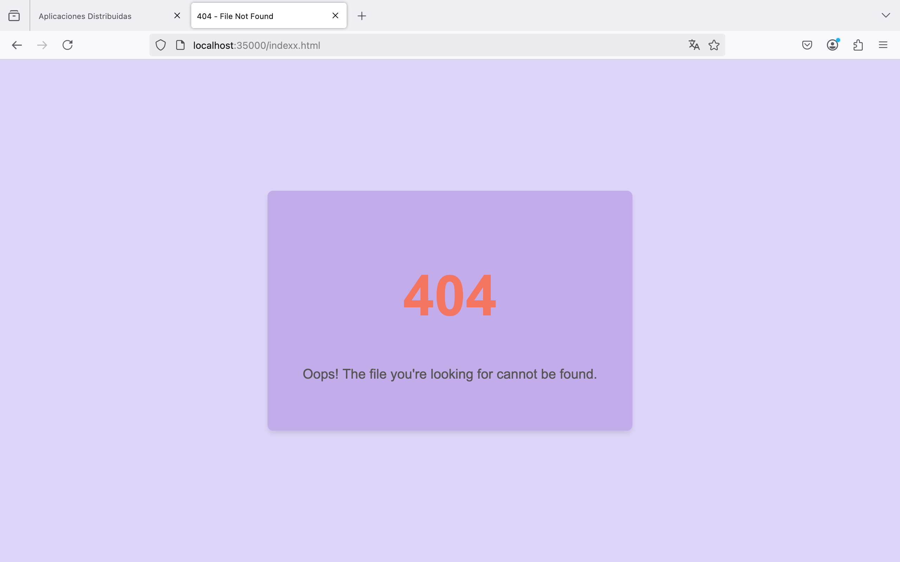 

### **Static Image Loading Tests**  

- **`shouldLoadStaticImagePNG`**: Checks that the server can serve `imagen1.png` by sending a `GET` request and expecting a `200 OK` response.  

- **`shouldLoadStaticImageJPG`**: Verifies that the server correctly loads `imagen2.jpg` by sending a `GET` request and expecting a `200 OK` response.  

- **`notShouldLoadStaticImagePNG`**: Ensures that the server does not serve `imagen8.png` because it does not exist, expecting a `404 Not Found` response.  

- **`notShouldLoadStaticImageJPG`**: Checks that `imagen20.jpg` is not available on the server, expecting a `404 Not Found` response.  


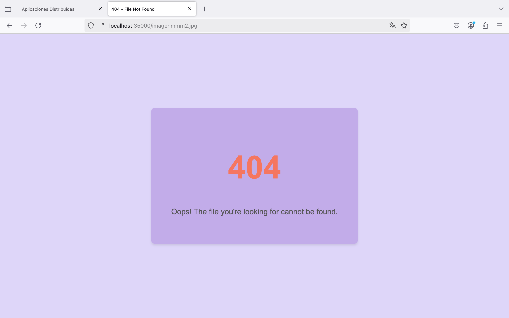

### **`greeting` Controller Tests**  

- **`shouldLoadGreetingControllerWithQuery`**: Verifies that the API returns `{"response":"Hello maria !"}` when requesting `app/greeting?name=maria`.  

- **`shouldLoadGreetingControllerWithoutQuery`**: Ensures that the API returns `{"response":"Hello world !"}` when requesting `app/greeting` without parameters.  

- **`notShouldLoadGreetingControllerWithQuery`**: Ensures that the API **does not** return `{"response":"Hello juan !"}` when requesting `app/greeting?name=maria`.  

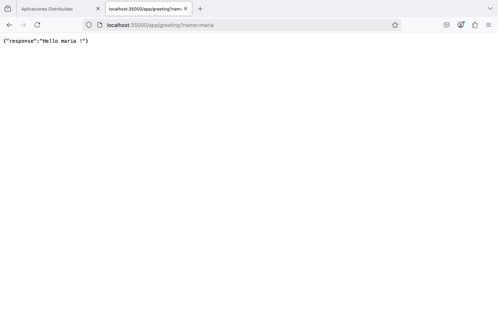
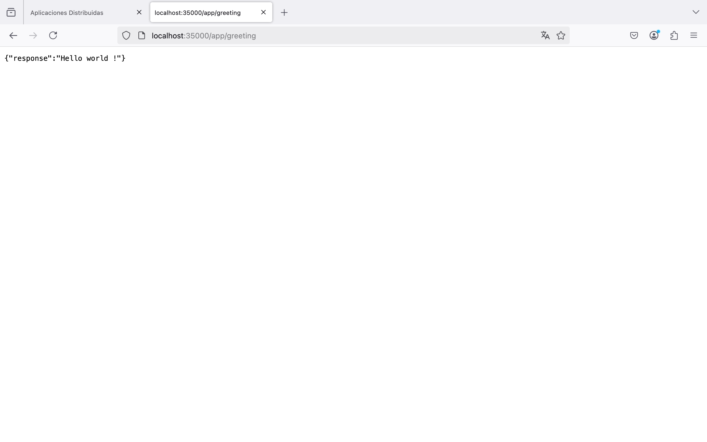


## **Mathematical Controller Tests**  

- **`shouldLoadMathControllerPIWithQuery`**: Verifies that the API returns `{"response":"3.14159"}` when requesting `app/pi?decimals=5`.  

- **`shouldLoadMathControllerPIWithoutQuery`**: Ensures that the API returns `{"response":"3.

14"}` when requesting `app/pi` without parameters.  

- **`notShouldLoadMathControllerPIWithQuery`**: Ensures that the API **does not** return `{"response":"3.141"}` when requesting `app/pi?decimals=5`.  
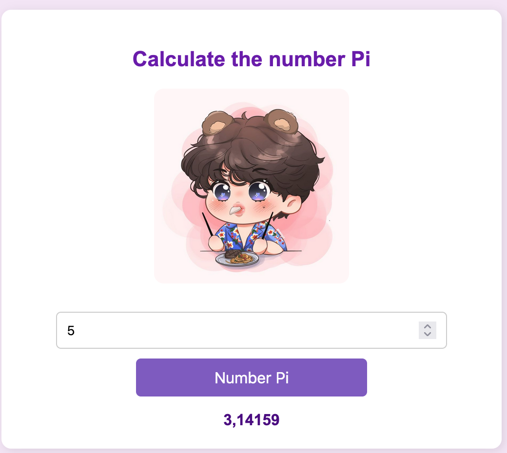
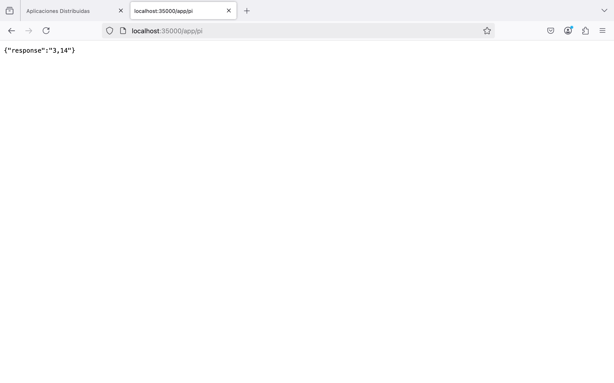
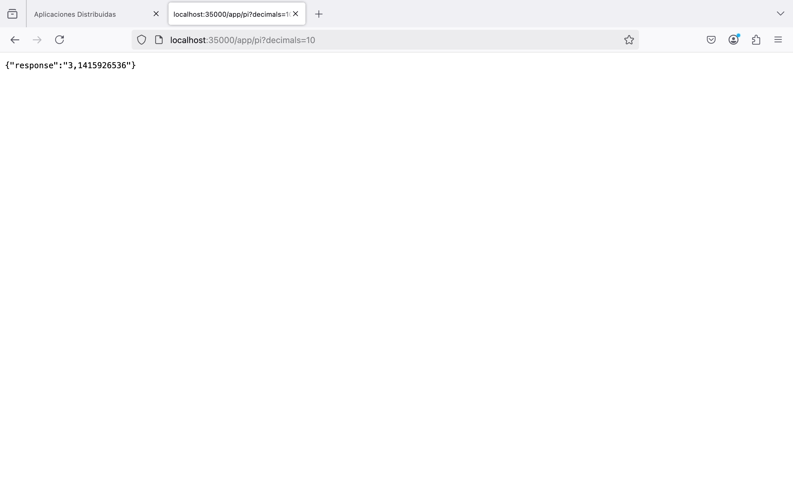

- **`shouldLoadMathControllerSumWithQuery`**: Verifies that the API returns `{"response":"10"}` when requesting `app/sum?number=3,2,5`.  

- **`shouldLoadMathControllerSumWithoutQuery`**: Ensures that the API returns `{"response":"No numbers entered"}` when requesting `app/sum` without parameters.  


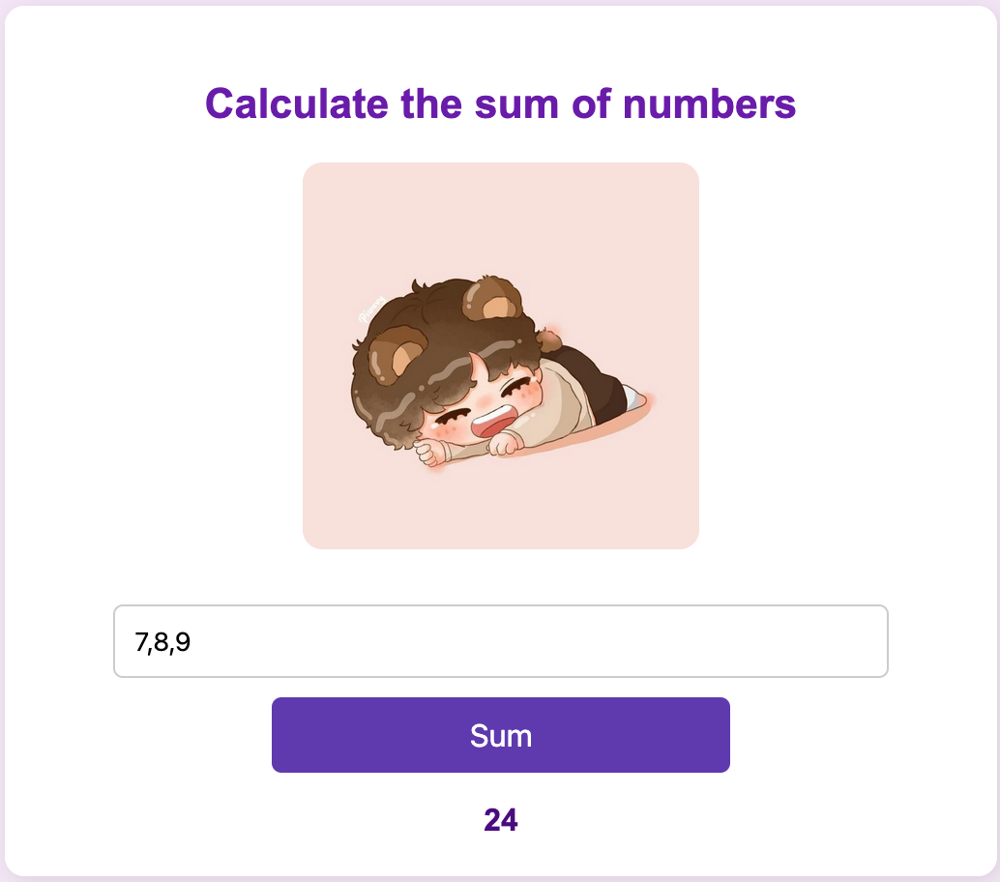

- **`shouldLoadMathControllerDivWithQuery`**: Ensures that the API returns `{"response":"2.0"}` when requesting `app/div?number=4,2`.  

- **`shouldLoadMathControllerDiv2WithQuery`**: Verifies that the API returns `{"response":"Cannot divide by 0"}` when requesting `app/div?number=4,0`, properly handling division by zero.  

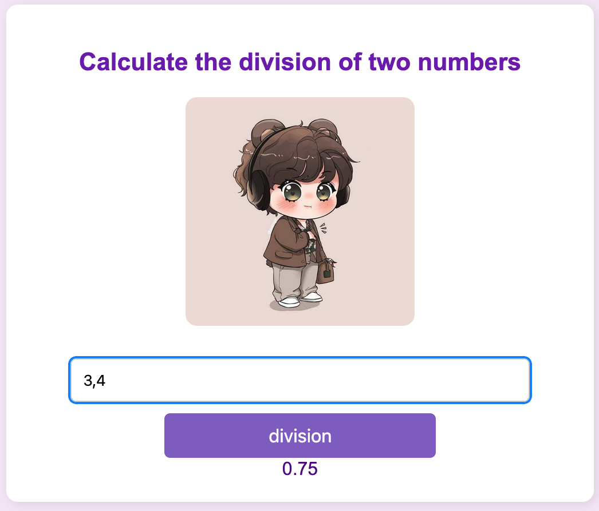
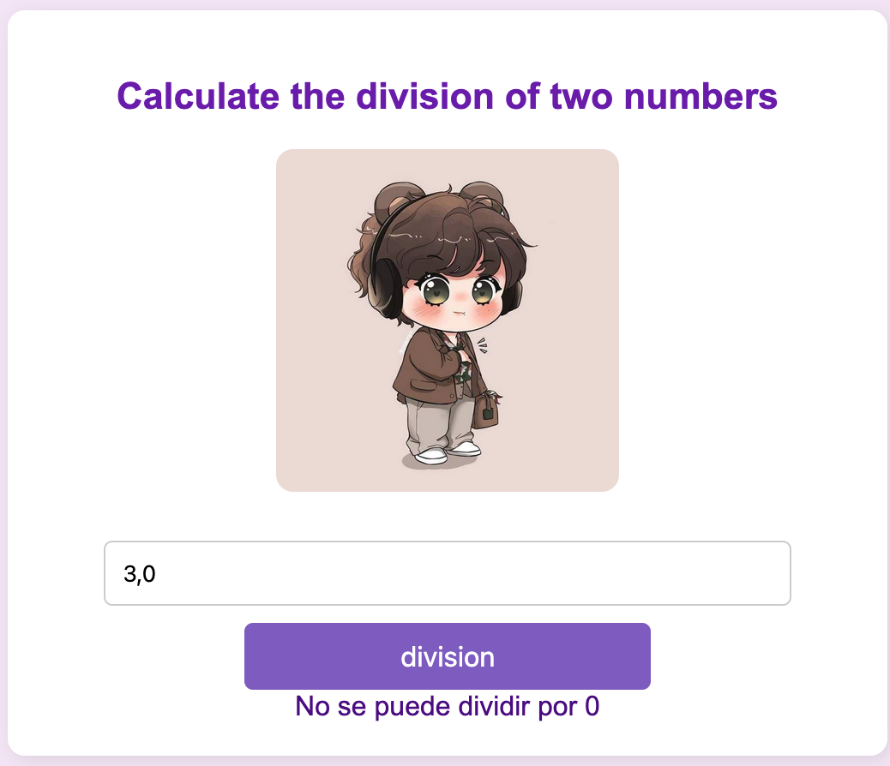

- **`shouldLoadMathControllerMulWithQuery`**: Ensures that the API returns the correct multiplication result when requesting `app/mul?number=2,3,4`, expecting `{"response":"24"}`.  

- **`notShouldLoadMathControllerMulWithQuery`**: Verifies that the API does not return an incorrect multiplication result when requesting `app/mul?number=2,3,4`, ensuring proper computation.  


- **`shouldLoadMathControllerSubWithQuery`**: Ensures that the API returns the correct subtraction result when requesting `app/sub?number=10,3,2`, expecting `{"response":"5"}`.  

- **`notShouldLoadMathControllerSubWithQuery`**: Verifies that the API does not return an incorrect subtraction result when requesting `app/sub?number=10,3,2`, ensuring proper computation.  

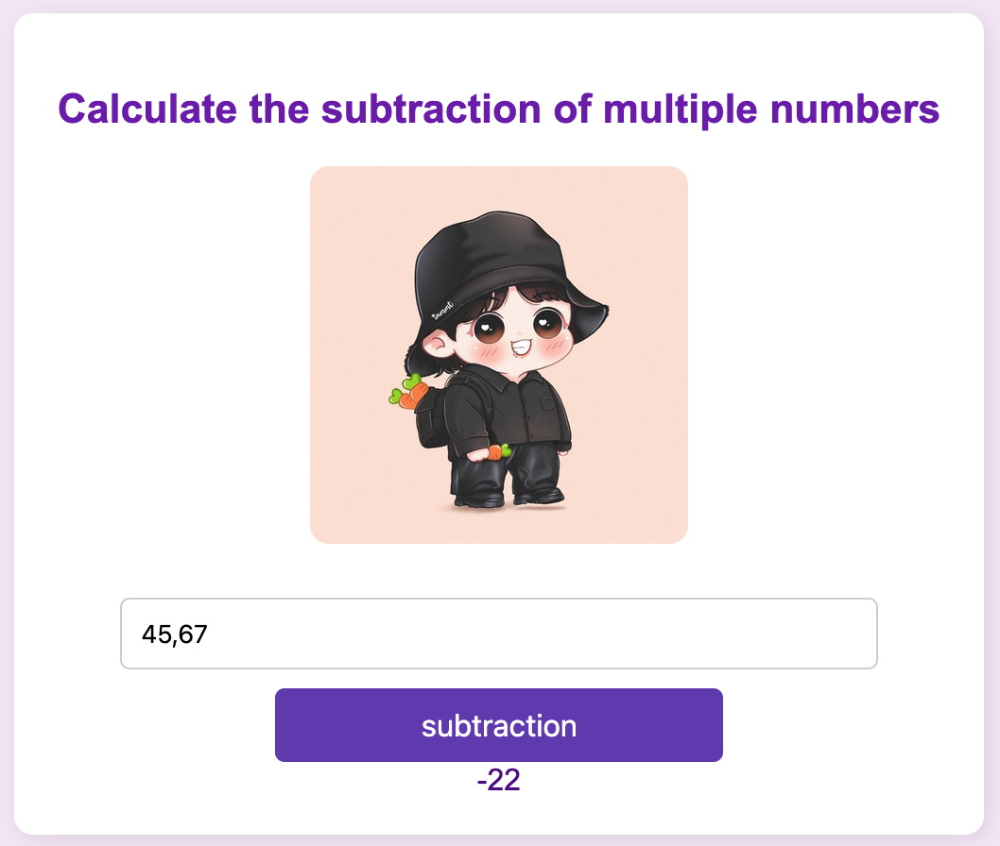
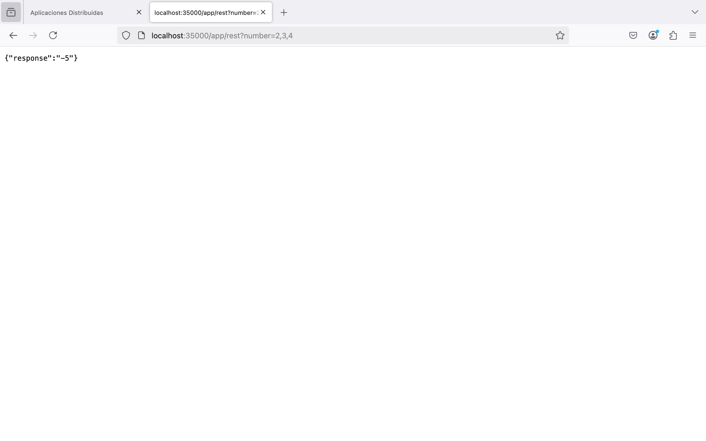

With the `mvn test` command, we can run the tests on our server.


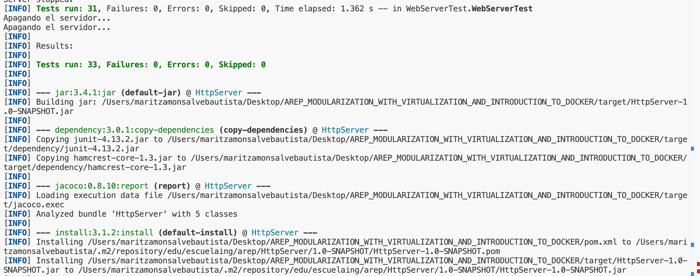

## Built With

[Maven](https://maven.apache.org/index.html) - Dependency Management

[Git](https://git-scm.com) - Version Control System

## Authors

Maria Valentina Torres Monsalve - [Mar972310](https://github.com/Mar972310)
